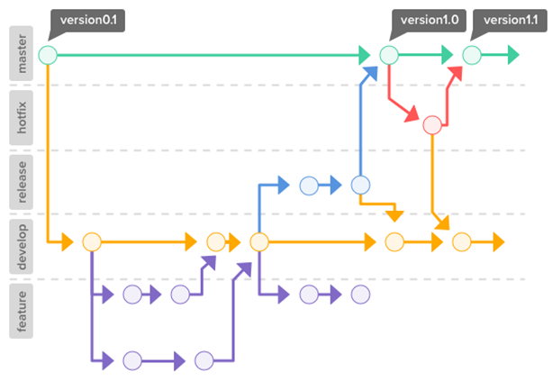

# A Git Style Guide

# Table of contents
1. [Branches](#Branches)
2. [Commits](#Commits)
3. [References](#References)
## Branches

*	**Master branch:** This branch just for stable version.
*	**Hotfix branch:** For quick bug fixes from stable version.
*	**Release branch:** For beta version.
*	**Develop:** It is for app development and we mostly work with this branch.
*	**Feature:** There can be many branches for feature.

 
## Commit message style

Semantic Commit Messages

**Format:** \<type>(\<scope>): \<subject> \<scope> is optional

**Example**
`feat: add hat wobble`
^--^  ^------------^
|     |
|     +-> Summary in present tense.
|
+-------> Type: chore, docs, feat, fix, refactor, style, or test.

**More Examples:**
*	**feat:** (new feature for the user, not a new feature for build script)
*	**fix:** (bug fix for the user, not a fix to a build script)
*	**docs:** (changes to the documentation)
*	**style:** (formatting, missing semi colons, etc; no production code change)
*	**refactor:** (refactoring production code, eg. renaming a variable)
*	**test:** (adding missing tests, refactoring tests; no production code change)
*	**chore:** (updating grunt tasks etc; no production code change)

**Example \<scope> value:**
*	init
*	runner
*	watcher
*	config
*	web-server
*	proxy
*	etc.

## References:
*	https://www.conventionalcommits.org/
*	https://seesparkbox.com/foundry/semantic_commit_messages
*	http://karma-runner.github.io/1.0/dev/git-commit-msg.html
